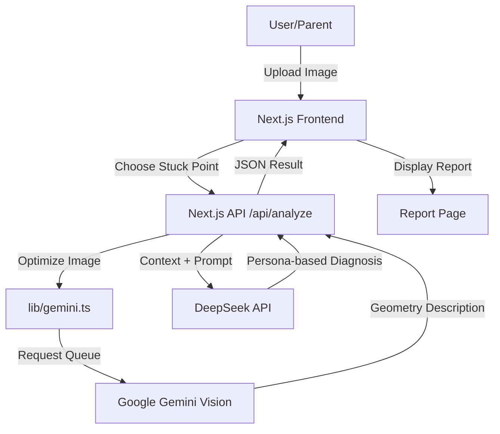

# Architecture Overview

## System Flow

## Key Components
1. **Frontend**: Next.js (App Router), Tailwind CSS, Framer Motion for animations.
2. **API Routes**: `/api/analyze` handles the orchestration between Vision and Reasoning.
3. **Services**:
   - `lib/gemini.ts`: Handles image optimization (sharp) and queued requests to Google.
   - `lib/deepseek.ts`: (Integrated in route) handles LLM-based diagnosis.
4. **Middleware/Logic**:
   - Singleton Request Queue to avoid 429 errors.
   - Exponential Backoff for resilient API calls.
